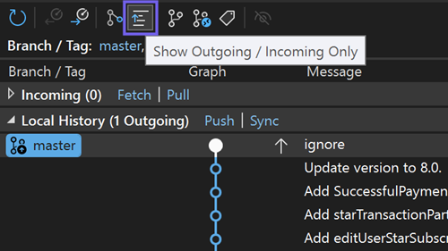

[Okno úložiště Gitu](vscmd://Team.Git.GoToGitSynchronization) {KeyboardShortcut:Team.Git.GoToGitSynchronization} je místo s informacemi o historii používání Gitu. Když pracujete na místní větvi, může dojít k výpadku synchronizace se vzdáleným úložištěm, a to buď proto, že jste vytvořili nová potvrzení (odchozí), nebo že existují nová potvrzení pro přijetí změn (příchozí).

S novým odchozím nebo příchozím filtrem dostupným na panelu nástrojů můžete taková nesynchronizovaná potvrzení okamžitě odhalit. Sledováním vlastních potvrzení i potvrzení jiných uživatelů si můžete snadno zajistit dokonalou synchronizaci.

