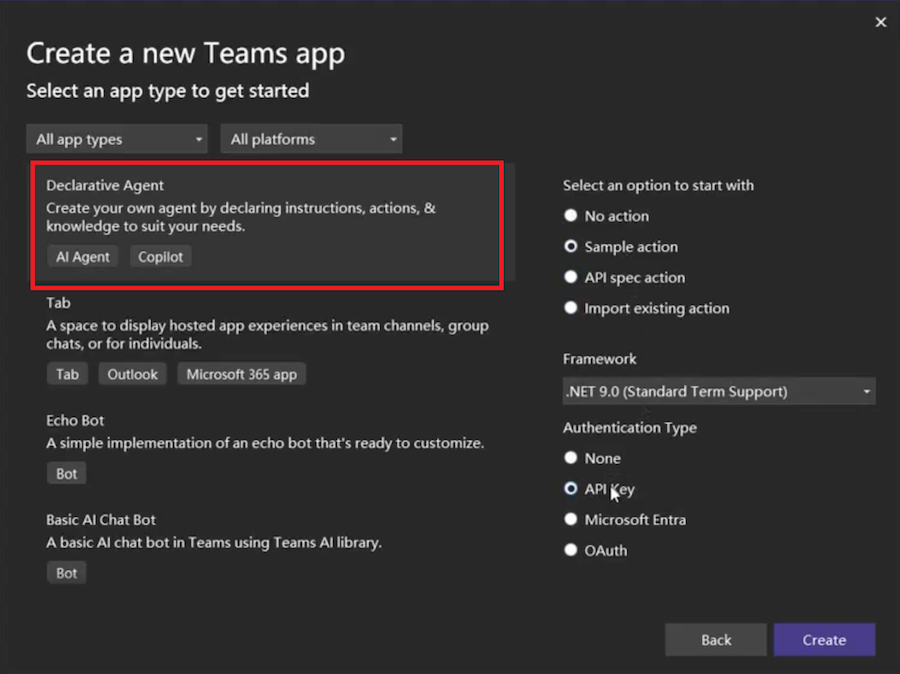
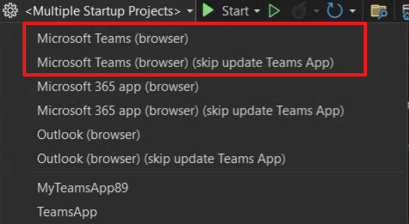
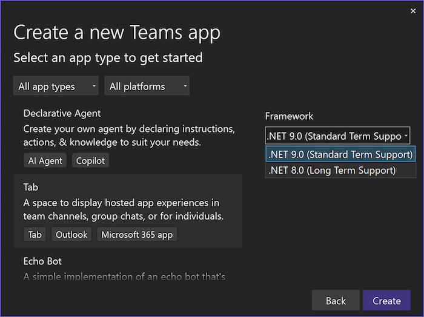

### Vytvoření deklarativního agenta

S radostí oznamujeme, že v této verzi sady nástrojů pro Teams jsme přidali šablony projektů pro vytváření deklarativních agentů pro nástroj Microsoft Copilot.

Deklarativního agenta můžete vytvořit s touto akcí nebo bez ní. Můžete definovat nová rozhraní API nebo využít existující rozhraní API k provádění úloh nebo načítání dat.

Pomocí sady nástrojů pro Teams můžete ladit a zobrazit náhled deklarativních agentů v nástroji Microsoft Copilot.

### Umožnění bezproblémového ladění jedním kliknutím
Když uživatelé v předchozích verzích ladili řešení vygenerované pomocí sady nástrojů Teams, museli před laděním projektu použít příkaz **Připravit závislosti aplikace Teams**. Tento příkaz aktivoval sadu nástrojů Teams, která vývojářům pomáhá vytvářet nezbytné prostředky pro ladění, jako je registrace nebo aktualizace aplikace Teams.

Abychom vylepšili možnosti ladění a zlepšili uživatelům sady Visual Studio jeho intuitivnost, odebrali jsme tento krok a umožnili jsme ladění jedním kliknutím. Teď můžete přímo kliknout na tlačítko ladění bez jakýchkoli přípravných kroků. Pokud jste ale v aplikaci Teams provedli úpravy mezi dvěma laděními a potřebujete aplikaci Teams aktualizovat, tuto možnost stále máte.
Nabízíme dva profily ladění:

- **Ladění s aktualizací aplikace Teams**: Pokud jste provedli úpravy aplikace Teams, vyberte výchozí profil **Microsoft Teams (prohlížeč)**. Tím zajistíte použití aktualizací.
- **Ladění bez aktualizace aplikace Teams**: Volbou druhého profilu **Microsoft Teams (prohlížeč) (přeskočit aktualizaci aplikace Teams)** přeskočíte aktualizaci prostředků aplikace Teams, takže ladění bude jednodušší a rychlejší.

### Upgrade na .NET 9

Sada nástrojů pro Teams v této verzi dále aktualizovala všechny šablony projektů, aby podporovaly .NET 9.

**Ať se vám dobře kóduje!**  
*Tým sady nástrojů pro Teams*
