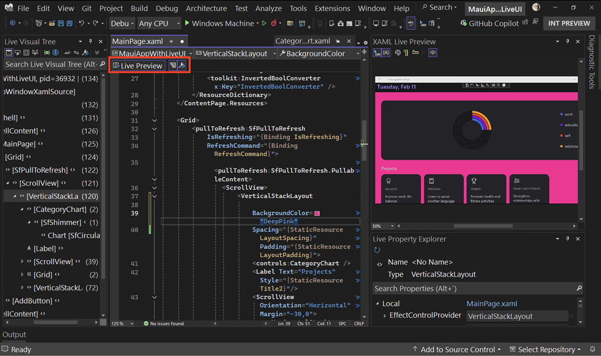

Die Live-Vorschau ist jetzt zur Entwurfszeit verfügbar und ermöglicht es Ihnen, Änderungen an der Benutzeroberfläche Ihrer App in Echtzeit zu sehen. Sie können auf diese Weise auch „Hot Reload“ und andere Live-UI-Tools verwenden und so einen nahtlosen Arbeitsablauf sicherstellen.

Diese Tools können auch losgelöst vom Debugger verwendet werden, so dass Sie ohne Unterbrechung experimentieren und Ihre Designs verfeinern können.

Klicken Sie auf den neuen Indikator **Live Vorschau**, um die Live-Vorschau zur Entwurfszeit aus jeder XAML-Datei aufzurufen:

Ganz gleich, ob Sie an einer neuen .NET MAUI App arbeiten oder eine bestehende WPF App verfeinern, diese Verbesserungen helfen Ihnen, qualitativ hochwertige Anwendungen schneller und sicherer zu erstellen.
