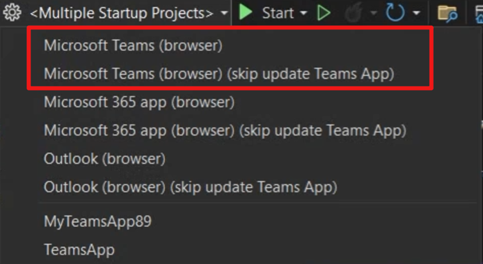

### Create declarative agent

We're excited to announce that in this release Teams Toolkit added project templates for building Declarative Agents for Microsoft Copilot.

You can create a Declarative Agent with or without an action. You can choose to define new APIs or utilize existing ones to perform tasks or retrieve data.

Use Teams Toolkit to debug and preview your Declarative Agents in Microsoft Copilot.

### Enable smooth one-click debug
In previous versions, when users debugged any solution generated using Teams Toolkit, they needed to use the command **Prepare Teams app dependency** before debugging the project. This command triggered Teams Toolkit to help developers create essential resources for debugging, such as registering or updating the Teams app.

To enhance the debugging experience and make it more intuitive for Visual Studio users, we have removed this step and enabled one-click debugging experience. Now, you can directly click the debug button without any preparation steps. However, if you have made edits to your Teams app between two debug events and need to update your Teams app, there remains an option to do that.
We offer two debug profiles:

- **Debug with updating Teams app**: Select the default profile **Microsoft Teams (browser)** if you have made edits to your Teams app to ensure the updates are applied.
- **Debug without updating Teams app**: Choose the second profile **Microsoft Teams (browser) (skip update Teams app)** to skip updating the Teams app resources, making debugging lighter and quicker.

### Upgrade to .NET 9

Additionally, in this release, Teams Toolkit has refreshed all project templates to support .NET 9.

**Happy coding!**  
*The Teams Toolkit Team*
