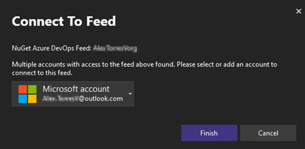

Nous avons amélioré le processus d’authentification NuGet. Si nous détectons des problèmes d'authentification potentiels, vous verrez désormais une nouvelle boîte de dialogue d'authentification qui fournit un contexte sur le flux et les besoins spécifiques du compte.

Cette mise à jour améliore le processus de réauthentification pour les scénarios d’authentification multifacteur (MFA), résout les problèmes liés aux invites d’authentification consécutives et garantit une expérience globale plus fluide lors de la gestion des flux NuGet privés.
