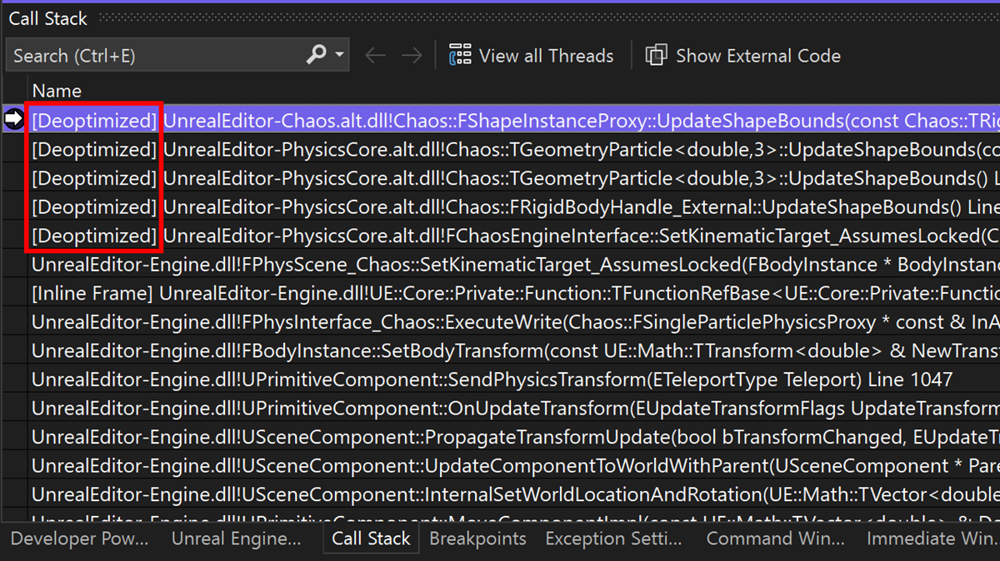

Il debug di codice ottimizzato non è mai stato così semplice. Attivando il debug dinamico di C++, è possibile eseguire il debug di codice ottimizzato come se non lo fosse. È possibile visualizzare tutte le variabili locali, intervenire in qualsiasi momento e impostare punti di interruzione completamente fedeli sui file binari ottimizzati. Per altri dettagli, leggere il [post di blog](https://aka.ms/dynamicdebugging).

