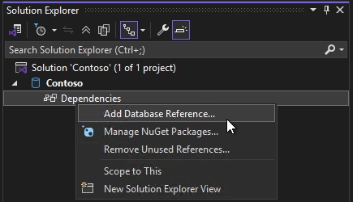

L'aggiornamento in Visual Studio 17.14 introduce nuovi modelli di elemento e riferimenti di database .dacpac a SQL Server Data Tools in stile SDK (anteprima). I progetti SQL SSDT in stile SDK sono basati su Microsoft.Build.Sql SDK, che offre il supporto per più piattaforme e funzionalità CI/CD migliorate per i progetti SQL Server Data Tools (SSDT).

Il minor livello di dettaglio dei file di progetto e dei riferimenti di database ai pacchetti NuGet consente ai team di collaborare in modo più efficiente su database di grandi dimensioni all'interno di un singolo progetto o di compilare più set di oggetti da diversi progetti. Le distribuzioni di database da un progetto Microsoft.Build.Sql possono essere automatizzate negli ambienti Windows e Linux che usano lo strumento dotnet Microsoft.SqlPackage per pubblicare l'artefatto della compilazione (.dacpac) dal progetto SQL. Altre informazioni sui [progetti SQL in stile SDK e DevOps per SQL](https://aka.ms/sqlprojects).

Nella versione 17.14, i [riferimenti di database](https://learn.microsoft.com/sql/tools/sql-database-projects/concepts/database-references?pivots=sq1-visual-studio-sdk) sono stati ampliati per supportare i riferimenti di artefatti .dacpac e di progetto. Il supporto per i riferimenti di database come riferimenti di pacchetti sarà disponibile in una versione futura. Un aggiornamento recente al [generatore di file di soluzioni slngen](https://github.com/microsoft/slngen) ha aggiunto anche il supporto per i progetti Microsoft.Build.Sql, consentendo la gestione di soluzioni di grandi dimensioni a livello di programmazione.

Per usare i progetti SQL in stile SDK nella soluzione, assicurarsi di installare il componente dell'anteprima SSDT più recente nel programma di installazione di Visual Studio.

