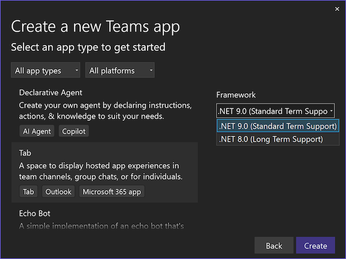

### Creare un agente dichiarativo

Siamo entusiasti di annunciare che in questa versione il Toolkit di Teams ha aggiunto modelli di progetto per compilare agenti dichiarativi per Microsoft Copilot.

È possibile creare un agente dichiarativo con o senza un'azione. È possibile scegliere di definire nuove API o di usare quelle esistenti per eseguire attività o recuperare dati.

Usare il Toolkit di TEams per eseguire il debug e l'anteprima di agenti dichiarativi in Microsoft Copilot.

### Abilitare il debug con un clic senza problemi
Nelle versioni precedenti, per eseguire il debug di qualsiasi soluzione generata usando il Toolkit di Teams, gli utenti dovevano usare il comando **Preparare le dipendenze dell'app Teams** prima di eseguire il debug del progetto. Questo comando attivava il Toolkit di Teams per consentire agli sviluppatori di creare risorse essenziali per il debug, ad esempio la registrazione o l'aggiornamento dell'app Teams.

Per migliorare l'esperienza di debug e renderla più intuitiva per gli utenti di Visual Studio, si è rimosso questo passaggio e si è reso possibile il debug con un clic. È ora possibile fare clic direttamente sul pulsante di debug senza alcuna procedura di preparazione. Tuttavia, se sono state apportate modifiche all'app Teams tra due eventi di debug ed è necessario aggiornare l'app Teams, rimane un'opzione per assolvere a questo scopo.
Sono disponibili due profili di debug:

- **Eseguire il debug con l'aggiornamento dell'app Teams**: selezionare il profilo predefinito **Microsoft Teams (browser)** se sono state apportate modifiche all'app Teams per assicurarsi che gli aggiornamenti vengano applicati.
- **Eseguire il debug senza l'aggiornamento dell'app Teams**: scegliere il secondo profilo **Microsoft Teams (browser) (saltare l'aggiornamento dell'app Teams)** per non aggiornare le risorse dell'app Teams, rendendo il debug più leggero e più rapido.

### Eseguire l'aggiornamento a .NET 9

Inoltre, in questa versione il Toolkit di Teams ha aggiornato tutti i modelli di progetto per supportare .NET 9.

**Buon lavoro.**  
*Il Team del Toolkit di Teams*
