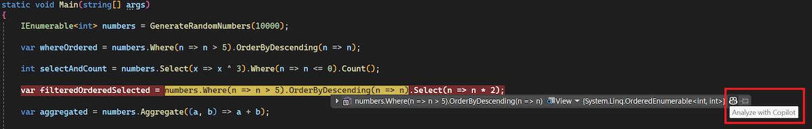

A geração e a solução de problemas de consultas LINQ podem ser um processo tedioso e complexo, muitas vezes exigindo conhecimento preciso da sintaxe e várias iterações. Para aliviar esses desafios, o Visual Studio 2022 agora apresenta um DataTip de LINQ ao focalizar no depurador.

Enquanto estiver em um estado de pausa durante a depuração, você pode passar o mouse sobre cláusulas ou segmentos individuais da consulta LINQ para avaliar o valor imediato da consulta em tempo de execução.

Além disso, você pode clicar no ícone do GitHub Copilot no final de um DataTip para executar uma *Análise com o Copilot* na cláusula de consulta específica sobre a qual você passou o mouse. O Copilot explicará a sintaxe da cláusula e esclarecerá por que você está obtendo o resultado especificado.

Esse recurso pode aumentar significativamente a eficiência e tornar a experiência de depuração mais suave e fácil, ajudando a identificar problemas com consultas LINQ mais rapidamente e a otimizar o fluxo de trabalho geral de desenvolvimento.

### Quer experimentar?
Ative o GitHub Copilot Free e desbloqueie esse recurso de IA, além de muito mais.
Sem trials. Sem cartão de crédito. Apenas sua conta do GitHub. [Obtenha o Copilot Free](https://github.com/settings/copilot).
