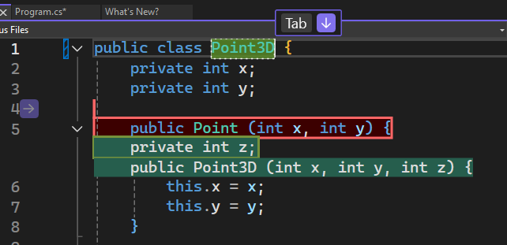
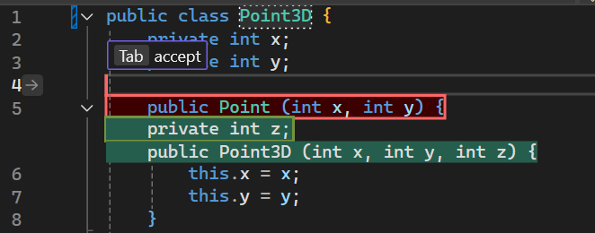
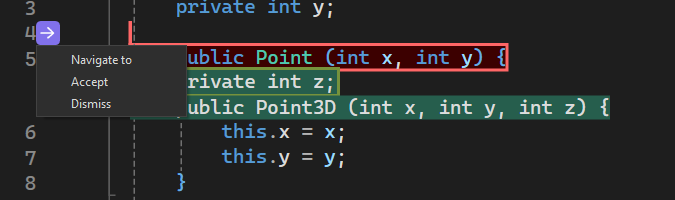

Temos o prazer de anunciar que a opção Próxima sugestão de edição, ou NES, agora está disponível no Visual Studio para melhorar ainda mais sua experiência de codificação. O NES aproveita as edições anteriores feitas e prevê a próxima edição que está por vir, seja uma inserção, exclusão ou mistura de ambas. Ao contrário dos preenchimentos, que se limitam a gerar sugestões no local do cursor, o NES pode oferecer suporte a você em qualquer lugar do arquivo, onde a próxima edição é mais provável de ocorrer. O NES aumenta a experiência existente do Copilot Completions apoiando as atividades de edição de código dos desenvolvedores.

### Introdução ao NES
Habilite o NES em **Ferramentas > Opções > GitHub > Copilot Completions > Habilitar próximas sugestões de edição.**

Assim como o preenchimento, tudo o que você precisa fazer para obter o NES é começar a programar!

Quando for apresentada uma sugestão de edição, se ela estiver em uma linha diferente daquela em que você está agora, ela sugerirá que você **Pressione Tab primeiro para navegar até a linha** correspondente. Você não precisará mais procurar manualmente por edições relacionadas; o NES vai liderar o caminho!

 

Depois de estar na mesma linha da edição, você pode **usar a tecla Tab para aceitar** a sugestão.

  

Observação: você pode ativar/desativar as barras de dicas acessando **Ferramentas > Opções > IntelliCode > Avançado > Ocultar a dica mostrada com texto** cinza. 

Além das barras de dicas, uma seta na medianiz também aparece para indicar que há uma sugestão de edição disponível. Você pode clicar na seta para explorar o menu de sugestões de edição.

  

### Cenários de exemplo
As próximas sugestões de edição podem ser úteis em uma variedade de cenários, não apenas fazendo mudanças repetitivas óbvias, mas também mudanças lógicas. Estes são alguns exemplos:

**Refatoração de uma classe de ponto 2D para ponto 3D:**
 

**Atualização da sintaxe do código para o C++ moderno usando STL:**

Observe que o NES não está apenas fazendo alterações repetitivas, como atualizar tudo `printf()` para `std::cout`, mas também atualizando outras sintaxes, como `fgets()`.

**Fazendo alterações lógicas em resposta a uma variável recém-adicionada:**

O NES responde rapidamente à nova variável, que adiciona um número máximo de suposições que um jogador pode fazer em um jogo, e o Copilot Completions também entra em cena para ajudar.

### Quer experimentar?
Ative o GitHub Copilot Free e desbloqueie esse recurso de IA, além de muito mais.
Sem trials. Sem cartão de crédito. Apenas sua conta do GitHub. [Obtenha o Copilot Free](https://github.com/settings/copilot).
