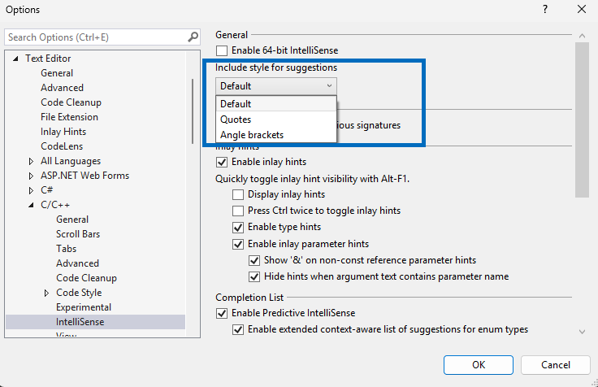

Теперь вы можете проследить за тем, какие заголовки будут представлены в списке для автоматического дополнения, когда вы будете вводить элемент `#include`.

Теперь настройка раскрывающегося списка, доступная в разделе **Инструменты > Параметры > Текстовый редактор > C/C++ > IntelliSense > Стиль включения в рекомендации**, влияет и на рекомендации, и на список элементов для автоматического дополнения, поскольку мы внесли следующие усовершенствования:

- **Основные рекомендации (по умолчанию)**: в относительных путях применяются кавычки, а в любых других элементах — угловые скобки.
- **Режим кавычек**: применение кавычек в любых заголовках, кроме стандартных, где применяются угловые скобки.
- **Режим угловых скобок**: во всех заголовках, входящих в путь включения, применяются угловые скобки.

Раньше в рекомендациях все заголовки (кроме относительных) выглядели одинаково вне зависимости от синтаксиса. Благодаря этому обновлению у вас появилась возможность указать, как именно должны выглядеть рекомендации заголовков при использовании `#include <> and #include ""`.
